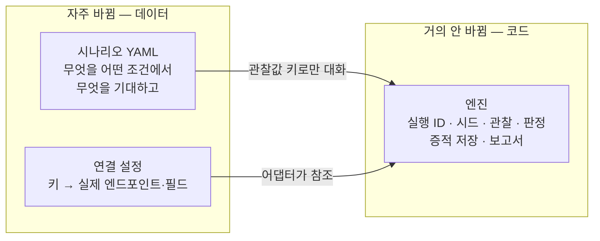
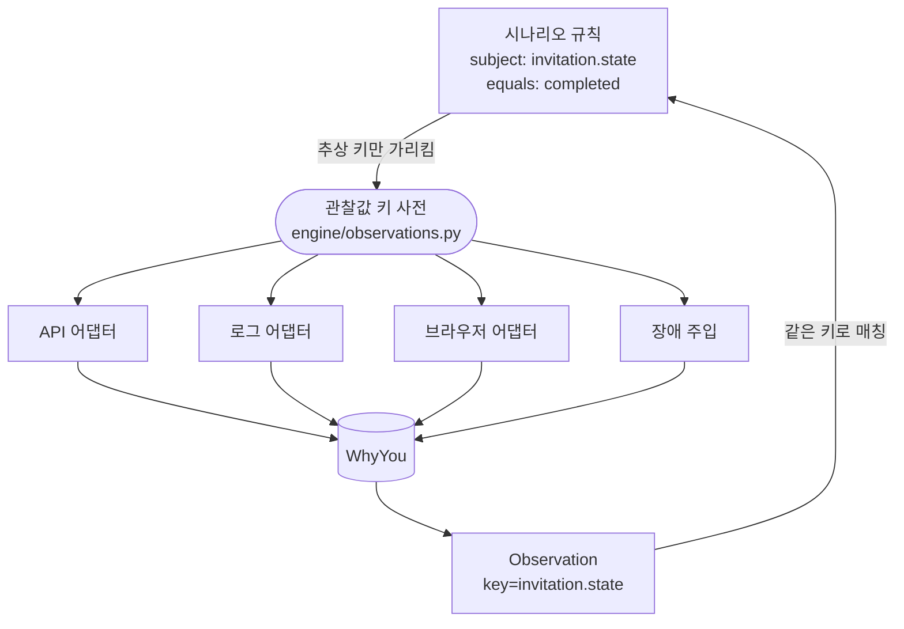
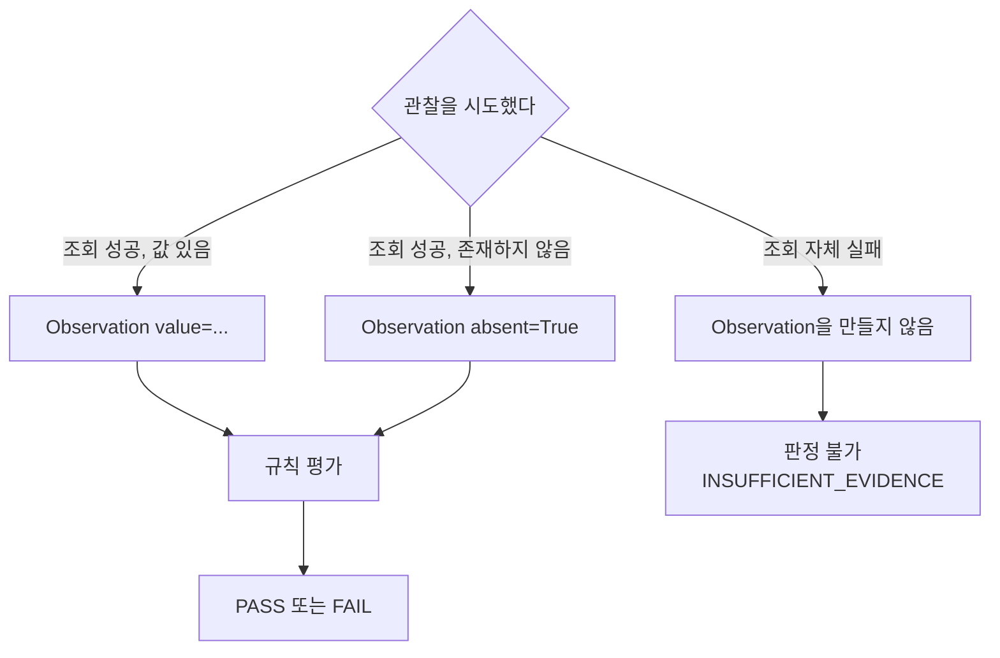
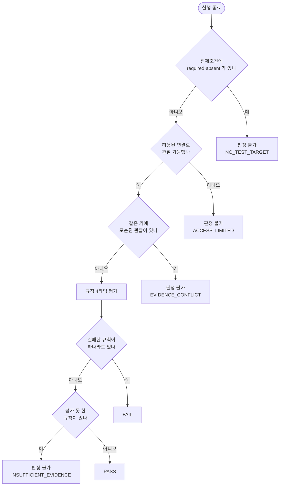
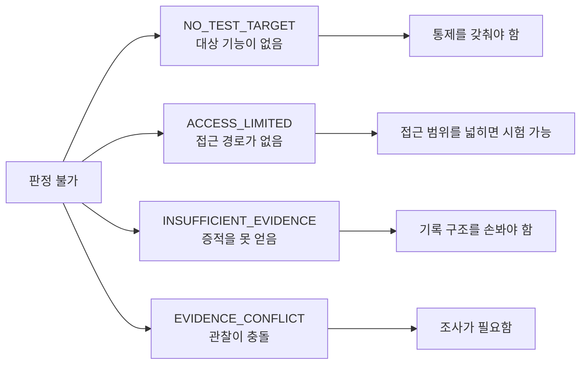
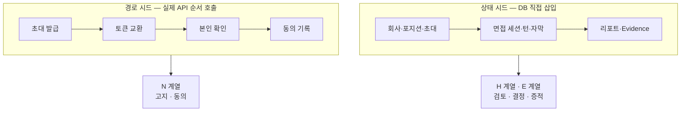
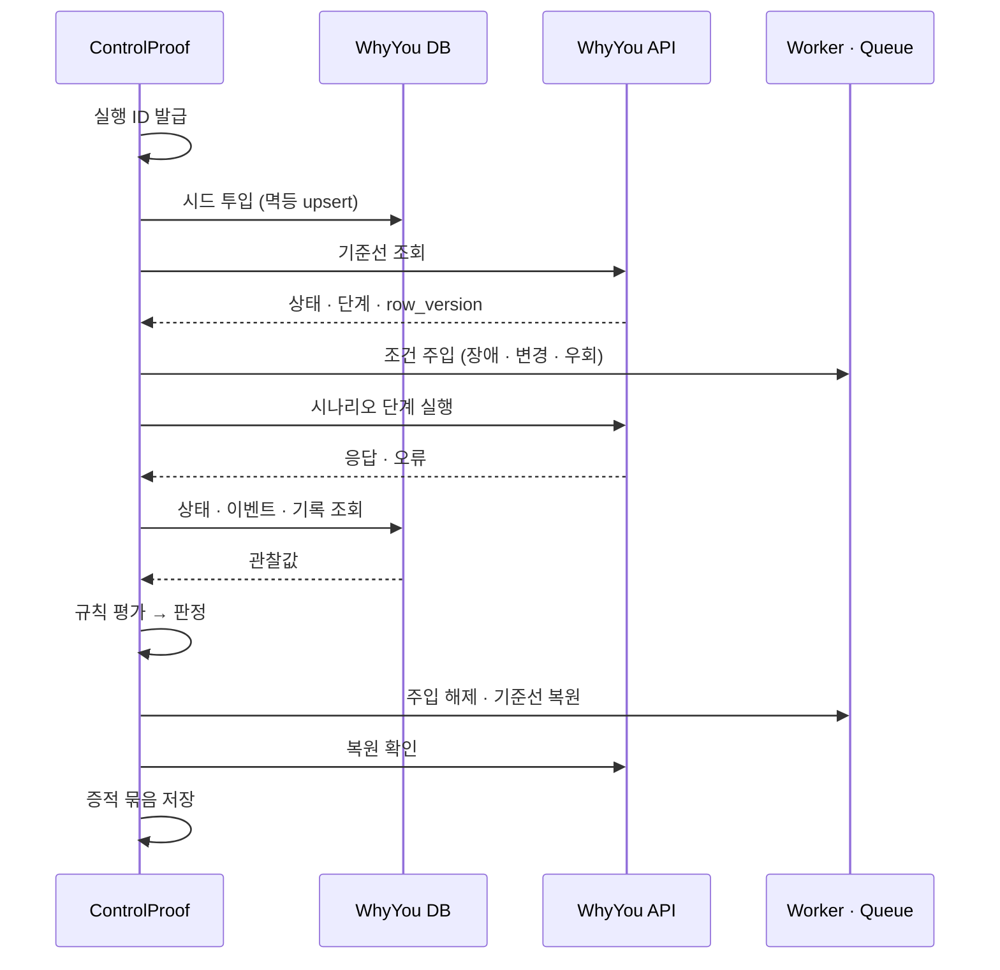
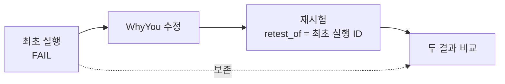
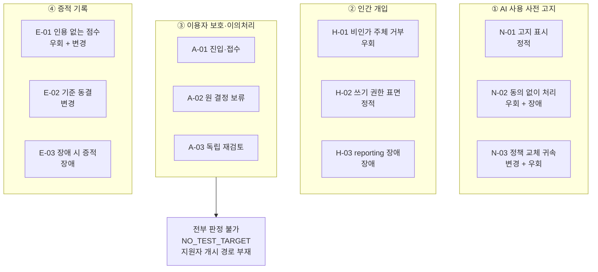

# 아키텍처

`CLAUDE.md`의 규칙을 그림으로 옮긴 것. 코드를 읽기 전에 이걸 먼저 본다.

---

## 1. 무엇이 바뀌고 무엇이 안 바뀌는가

이 경계가 이 프로젝트의 핵심 설계다. 착수 당일 시나리오를 네 번 갈아엎었지만
코드는 한 줄도 쓰지 않았다. 앞으로도 이래야 한다.

엔진을 고쳐야 하는 사유는 셋뿐이다.

| 사유 | 비용 |
|---|---|
| 새 관찰 수단이 필요 | 어댑터 하나 추가. 기존 것은 그대로 |
| 판정 규칙 타입이 모자람 | 규칙 하나 추가 |
| **증적 스키마 변경** | **비싸다.** 어댑터·판정·저장·보고서가 전부 영향 |

그래서 D1에 스키마를 고정하고, D5에 H-03을 수직으로 관통시켜 검증한다.
D5에 깨지는 건 싸고 D11에 깨지면 비싸다.

---

## 2. 관찰값 키 — 시나리오와 어댑터의 유일한 접점

시나리오는 `invitation.state`라고만 쓴다. 그 키를 어느 엔드포인트의 어느
필드에서 가져올지는 어댑터의 연결 설정이 정한다.

**고객사가 바뀌면 연결 설정만 교체하고 시나리오 YAML은 그대로 둔다.**
키 자체를 바꿔야 한다면 그건 매핑이 아니라 시나리오 교체다.

---

## 3. Observation의 세 가지 상태 — FAIL과 판정 불가를 가르는 지점

어댑터가 여기서 대충하면 **없는 것을 확인한 것처럼 판정된다.**
이 프로젝트에서 가장 미묘하고 가장 중요한 구분이다.

"없었다"와 "못 봤다"는 다르다. 조회에 실패했는데 `absent=True`를 만들면
없는 것을 확인한 것처럼 처리된다.

---

## 4. 판정 흐름

두 가지 설계 판단이 들어 있다.

**FAIL이 판정 불가보다 우선한다.** 관찰된 실패는 다른 증적을 못 얻었다고
사라지지 않는다.

**대상이 없으면 규칙을 아예 평가하지 않는다.** 없는 것을 통과시키지 않기
위해서다. A-01~A-03이 여기서 걸러진다.

---

## 5. 판정 불가 네 가지 — 고객이 받는 처방이 다르다

뭉뚱그려 "판정 불가"로만 적으면 보고서가 쓸모를 잃는다.

---

## 6. 시드 두 종류 — 섞지 않는다

- 상태 시드로 만든 지원자는 **동의 화면을 거치지 않았다** → N 계열에 쓸 수 없다
- 경로 시드로 만든 지원자는 **면접·리포트가 없다** → H·E 계열에 쓸 수 없다
- E-02는 둘 다 쓴다. 동의 정책 버전은 경로 시드에서, 평가 기준 버전은 상태 시드에서

---

## 7. 실행 한 바퀴

복원 확인을 건너뛰지 않는다. 다음 실행의 기준선이 오염되면 재현성이 깨진다.

---

## 8. 재시험은 덮어쓰지 않는다

알고 있는 결함을 미리 고치고 시험하면 이 그림이 성립하지 않는다.
**고치고 시험하지 말고, 시험하고 고친다.**

---

## 9. 통제 4종 × 시나리오 12개

시험 가능 9개 중 **7개가 조건을 직접 만드는 시나리오**다.
정적 2개(N-01·H-02)는 기존 QA로도 가능하며, 이 사실을 보고서에 숨기지 않는다.

---

## 10. 2주 일정

```mermaid
gantt
    dateFormat X
    axisFormat D%d
    section 기반
    스키마·판정·로더 (완료)   :done, d1, 0, 1d
    상태 시드 (완료)          :done, d2, 1, 1d
    장애 주입 훅              :d3, 2, 1d
    API·로그 어댑터           :d4, 3, 1d
    section 수직 관통
    H-03 완주                 :crit, d5, 4, 1d
    증적 저장·실행 ID 연결    :d6, 5, 1d
    section 시나리오
    E-03                      :d7, 6, 1d
    경로 시드 + N-02          :d8, 7, 1d
    E-01 · E-02               :d9, 8, 1d
    H-01 · H-02 · N-01        :d10, 9, 1d
    section 마무리
    재시험 비교               :crit, d11, 10, 1d
    보고서·일괄 실행          :d12, 11, 1d
```

D5가 분기점이다. 스키마가 틀렸다면 여기서 드러나야 한다.
D5까지 못 가면 시나리오 수를 줄이고 H-03·E-03만 완주하는 쪽으로 튼다.
